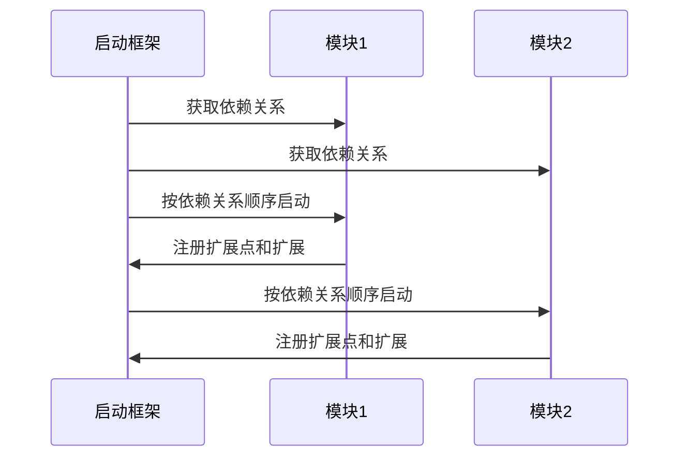
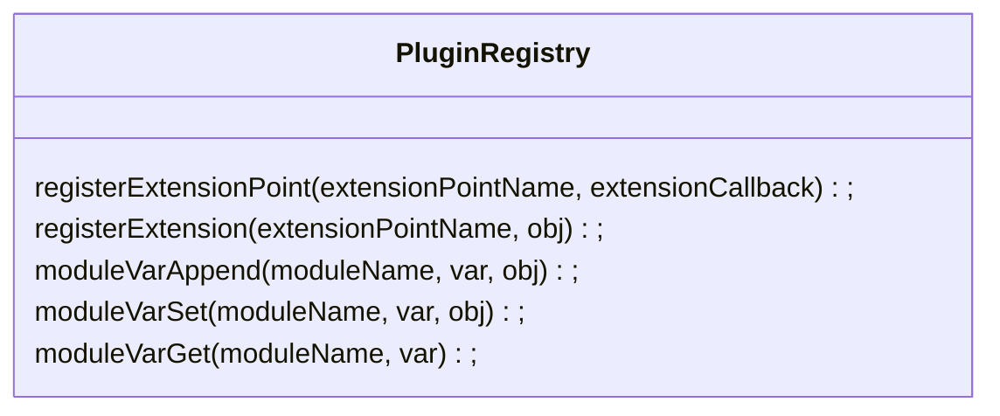

# 目标

让Vue像后台模块一样能通过插件方式添加功能。参考：

* [贡献式编程](https://blog.csdn.net/kmtong/article/details/39022525)


# 设计思路

[Vue启动钩子](https://cn.vuejs.org/v2/guide/instance.html#%E5%AE%9E%E4%BE%8B%E7%94%9F%E5%91%BD%E5%91%A8%E6%9C%9F%E9%92%A9%E5%AD%90)
提供了很好的切入点。

我们需要一个插件注册和使用过程，当中涉及到：

1. 插件命名定位坐标
2. 插件依赖关系描述
3. 插件加载过程
4. 扩展点定义
5. 扩展实现


能影响Vue行为的，可以有以下方面：

1. 全局的Vue.use(plugin): 使用 vue 插件， [插件开发文档](https://cn.vuejs.org/v2/guide/plugins.html)
2. Vue.components: 
   1. [注册静态组件](https://cn.vuejs.org/v2/guide/components-registration.html)
   2. [注册动态组件](https://cn.vuejs.org/v2/guide/components-dynamic-async.html)
3. 注册路由


## 支持的扩展内容

1. 路由和其对应界面
2. 公共位置的贡献
   1. 菜单（附角色要求定义）
   2. 头部（如任务进度）
   3. 右上侧个人信息菜单扩展
   4. 其他
3. 组件扩展点定义，让对应的组件扩展嵌入到指定区域
4. 功能扩展（体现在处理上，而不是界面上）


## 扩展核心重点

* 提供命名空间注册表，让模块增加自己需要的【点】
* 插件框架提供注册和取值功能
* 注册值可以是普通静态值、函数或对象，为针对不同的场景
* 模块启动时，框架会调用模块的启动方法，让模块有机会注册自己的扩展内容







回调第一个参数时 StartupContext, 结构如下：

```json
{
    "vue": Vue,  // vue during Vue.use()
    "vueModx": VuexModule, // vuex-module during Vue.use()
    "registry": PluginRegistry,
    "config": { Options... }
}
```

```js
// when registerExtension is called, extensionCallback will be invoked
function extensionCallback(context, obj) {
    context.registry.moduleVarAppend('mymodule', 'menu', obj);
}
```

```js
// 简化可以用{}
function extensionCallback({registry}, obj) {
    registry.moduleVarAppend('mymodule', 'menu', obj);
}
```

```js
// in vue
const menu = this.$pluginRegistry.moduleVarGet("mymodule");
```

## 如何使用

```js
var VueModx = require('vue-modx')
var Module1 = require('module1')
var Module2 = require('module2')

Vue.use(VueModx, { modules: [Module1, Module2], config: {} })
```

## 实现Module结构

```js
export default {
    name: "module2",
    dependsOn: [ "module1" ],
    extensionPoints: {
        "module2.somepoint": function({registry}, obj) {
            registry.moduleVarAppend("module2", "somevar", obj);
        }
    },
    extensions: {
        // extend other module
        "module1.menu": {
            "name": "Module2 Menu",
            "roles": ["admin"]
        },
        // extend my own module
        "module2.somepoint": "Item1"
    },
    start({registry}) {
        // do some final initialization
        console.log(registry.moduleVarGet("module2", "somevar"));
    }
}
```

* extensions 里面可以使用函数来返回扩展值
* 若使用函数返回，其函数的入参 (context: StartupContext)
* VuexModule提供以下方法，方便插件调用：
  * modules()： 返回所有模块
  * moduleByName(name: string)： 查找某一个模块
